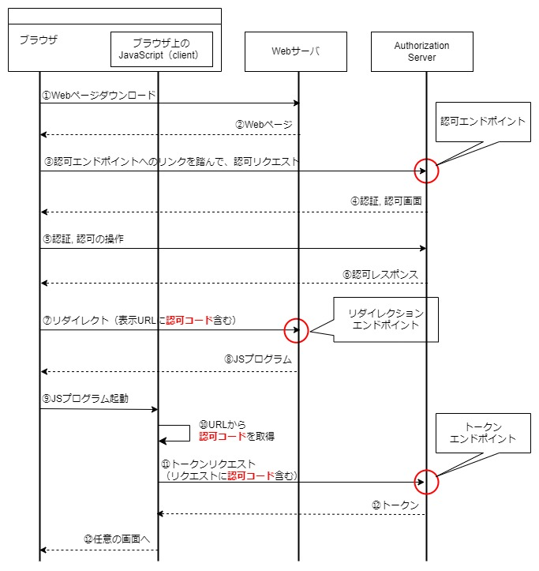

# OIDCのフローと具体的な実装例
[READMEに戻る](../README.md)

## OIDCのフロー
### フローの種類
OIDCでは以下のフローが知られている。それぞれ以下のサイトで解説されている。  
https://developer.okta.com/docs/concepts/oauth-openid/#choose-an-oauth-2-0-flow

- 認可コードフロー
- インプリシットフロー
- ハイブリッドフロー
- クライアントクレデンシャルフロー
- リソースオーナーパスワードクレデンシャルフロー

認可コードフローについては最も代表的であるため、以下で詳細を見ていく。

### OIDCの代表的なフロー 【認可コードフロー】

以下のようなフローでトークンが得られる。＊ブラウザ上でJavaScriptが実行されるアプリケーション(SPA)の場合



#### ポイント
1. 認証に成功すると、リダイレクションエンドポイントにリダイレクト ＊この時、URLのパラメータに**認可コード**を含む(③～⑦)
2. リダイレクションエンドポイントからJSをダウンロードし、そのコードを実行してURLから**認可コードを取得**(⑧～⑩)
3. **認可コードをリクエストに含めて**トークンエンドポイントへリクエストすることで、トークンを取得(⑪～⑫)

#### 用語の補足
- Client: トークンを発行してもらうアプリケーション
- Authorization Server: トークンを発行するサーバ
- 認可エンドポイント: ユーザーの認証, 認可を開始するためのエンドポイント。Authorization Serverが提供する。Authorization Serverが提供する
- トークンエンドポイント: トークンを取得するためのエンドポイント
- リダイレクションエンドポイント: 認可エンドポイントで認証や認可した結果を、clientが受け取るためのエンドポイント。clientが提供し、ユーザー端末がアクセスする

<a id="token_verification"></a>

### 取得したアクセストークンの検証
ClientからResource Server(アクセストークンを使ってアクセスされるサーバ=認証されたユーザーのみにコンテンツを配信するサーバともいえる)にアクセスする際、アクセストークンをResource Serverに渡す必要がある。Resource Serverは渡されたトークンの有効性を以下の方法で検証する。
- イントロスペクションリクエスト: 渡されたトークンをAuthorization Serverのイントロスペクションエンドポイントに送信し、有効か否かの結果を受け取る。
- [電子署名の検証](https://developer.mamezou-tech.com/blogs/2022/12/08/jwt-auth/#jws%E3%81%AE%E6%A4%9C%E8%A8%BC): トークンにはAuthorization Serverの秘密鍵による電子署名がある。Authorization Serverから公開鍵を取得し、受け取ったトークンの署名を検証できる

## 具体的な実装例
OIDC（認可コードフロー）が導入されたサンプルWebアプリケーションをローカルで実行してみましょう。

### 構成
- Authorization Server(localhost:8888): [Keycloak](https://www.keycloak.org/)でIDを管理
- Webサーバ(localhost:80): HTML, JSなど静的ファイルをNGINXで公開
- Resource Server(localhost: 8080): 渡されたトークンの署名を検証のうえ、コンテンツを返す


### アプリケーション起動コマンド
※docker, docker-composeインストール済みが前提
```shell
# ローカルMySQLを起動
./bin/mysql.sh
# 開発シェルにログイン
./bin/shell.sh
# DBマイグレーション
./bin/init-database.sh
# 開発シェルログアウト
exit
# アプリ起動 *Authorization, Web, Resource Serverがdocker-composeで起動する
./bin/run.sh
```

### ログイン方法
ログインURL: `http://localhost/login`  
初期ユーザー: `user1`, pass: `user1` ＊keycloak起動時に初期登録されます

#### 確認ポイント
- 認可コードフローのどの段階にいて、どのような処理が実行されているか、表示されるアニメーションにて確認
- ログイン後、認証成功時にAuthorization Serverから取得したアクセストークン, リフレッシュトークンがClient側でCookieにセットされており、Resouce Serverに渡すことで、DBに格納されているデータの参照や操作や許可される


#### 参考: ソースコード
- `app/front/default/pages/login.vue`: 認可エンドポイントへのリンクを生成
- `app/front/default/pages/callback.vue`: リダイレクトURLに含まれる認可コード抽出->ResourceServerに送信
- `app/api/auth.py`: Resource Serverにおけるアクセストークン検証ロジック, 認証が必要なAPIが依存している
