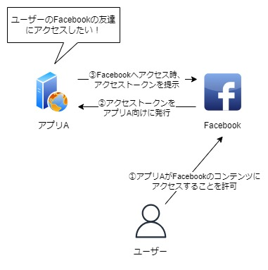
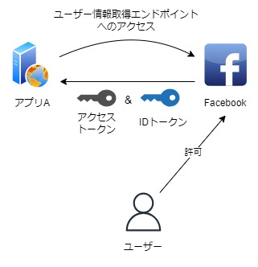

# OIDCの概要・利用シーン
[READMEに戻る](../README.md)

## OIDCの概要
### OIDCとOAuth2.0の関係
OIDCと混同されやすいものとしてOAuth2.0がある。それぞれの特徴はざっくり以下の通り、OAuth2.0を拡張したプロトコルがOIDCである。
| | 特徴 |
| -- | -- |
| OAuth2.0 | 2012年公開 認可のためのHTTPベースのプロトコル |
| OIDC | OAuth2.0をユーザー認証として活用するために拡張したもの |

#### OAuth2.0
- **ポイント**: ユーザーがアプリケーションに対し、認可をする
- 認可のフローは以下の通り

  0. (前提)アプリAはあるユーザーの別アプリのコンテンツ（ここではFacebookの友達）にアクセスしたい
  1. ユーザーはFacebookに対し、アプリAからのアクセスを許可する旨を伝える。＊許可する操作はFacebook上から
  2. FacebookがアプリAに対し、アクセストークンを発行
  3. アプリAがユーザーのFacebookの友達にアクセスする際、アクセストークンをFacebookに渡し、Facebookはトークンの有効性をチェックし、問題なければコンテンツへのアクセスを許可する

  

- **問題点**：OAuth2.0はあくまで「認可」のためのプロトコル。上記フローの①において、ユーザーがFacebookにてアクセス許可をする際、Facebookで認証されたことになるが、認証時の情報（認証の日時や手段）、ユーザーの情報（ユーザーのIDや名前,メールアドレス）を提供するための仕組みが定められていない。これだと、アプリAは「誰が」「いつ」「どのように」認証したのか分からない。

#### OIDC
- **ポイント**: OAuth2.0をユーザー認証として活用するために拡張したもの
- **拡張した点**: 認証時の情報を記載したIDトークンという概念と、ユーザの情報を取得するためのエンドポイントを定義  
  ＊IDトークンにユーザー情報も含まれ、ユーザー情報のエンドポイントが不要なケースもあり

  

## OIDCの代表的な利用シーン
### SNSなどのサイトのデータを利用する
[oidcとoauth20の関係](#oidcとoauth20の関係)の例で見た通り、Facebookの友達情報や、Googleのコンタクト情報などをアプリケーションで活用

### SNSなどのサイトに認証を任せる
- 認証の仕組みを自前で用意しようとすると、ID/PWの安全な保管、PW忘れ対応、2要素認証など、検討することが多い
- ユーザーにとっては、新しくアカウントを登録するより、SNSサイトなど登録済みアカウントでアプリを利用できたほうが便利  
=>ユーザー認証はSNSサイトに任せ、OIDCによって連携されてきたユーザー情報をもとに、アプリ側でアカウントを作成
