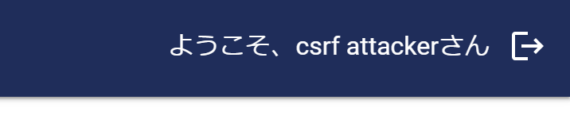

# OIDCに関連するセキュリティの脅威
[READMEに戻る](../README.md)

OIDCを利用するにあたってさまざまな脅威を考慮する必要がある。 [考慮すべき脅威の例](https://openid-foundation-japan.github.io/rfc6749.ja.html#anchor31)  

## どのようにして攻撃を受けるか体験してみる
OIDCを実装したアプリケーションに脆弱性が含まれていた場合、実際にどのような攻撃を受けるのか体験してみよう。

### クロスサイトリクエストフォージェリ
数ある脅威のうち、[クロスサイトリクエストフォージェリ(CSRF)](https://openid-foundation-japan.github.io/rfc6749.ja.html#CSRF)という手法をローカル環境で再現させる。

#### CSRFの概要
Webアプリケーションの代表的な脅威の一つで、攻撃者が用意したリンクをユーザーにアクセスさせ、ユーザーに意図しない処理を行わせる。  
OIDCの場合、リダイレクションエンドポイント（**※攻撃者の認可コードを付加したもの**）をユーザーにアクセスさせることで、ユーザーは攻撃者のアカウントでログインすることになる。ユーザーがそのことに気づかず情報を入力してしまうと、攻撃者はその情報を参照できてしまう。

#### CSRFをローカル環境で再現する
OIDCチュートリアルアプリを使い、CSRFによって攻撃者のアカウントでログインしてしまう例を見ていこう。 
- 構成は[OIDCのフローと具体的な実装例](./major_flow_and_example_impl.md)のOIDCチュートリアルアプリに加え、localhost:81番ポートで攻撃者のWebサイトが存在  
- Authorization Serverには、攻撃者のアカウント(csrf_attacker)が登録されている 

  

<a id="csfr_trial"></a>
CSRFを再現する手順は以下の通り。 


1. アプリケーションの起動, 一般ユーザーでログイン ＊ログイン後、使用したタブは残しておく
```shell
# ローカルMySQLを起動
./bin/mysql.sh
# 開発シェルにログイン
./bin/shell.sh
# DBマイグレーション
./bin/init-database.sh
# 開発シェルログアウト
exit
# アプリ起動
./bin/run.sh
```

| ログインURL | ユーザーID | Password |
| -- | -- | -- |
| http://localhost/login | user1 | user1 |

user1としてログインしていることを確認


2. 1.で使用したものと別のブラウザ, またはシークレットモードでOIDCチュートリアルアプリにアクセスし、攻撃者のアカウントで認証  

| ログインURL | ユーザーID | Password |
| -- | -- | -- |
| http://localhost/login | csrf_attacker | csrf_attacker |

3. リダイレクションエンドポイントのURLをコピーして、ブラウザを閉じる


4. 3.でコピーしたリダイレクションエンドポイントのURLを、`app/csrf/csrf_attack.html`のiframeタグのsrc属性に設定  
＊これで攻撃者のWebサイトが完成 => アクセスした時点で攻撃者のトークンがCookieにセットされてしまう

5. 1.で使用したブラウザの別タブで、攻撃者のWebサイト`http://localhost:81`にアクセス

6. 1.で一般ユーザーでログインしていたOIDCチュートリアルアプリのタブに戻り、更新ボタンを押下  
user1としてログインしたはずが、csrf attackerとしてログインした状態になってしまう  


## 対処方法
- [stateパラメータ](https://tech-lab.sios.jp/archives/8492)の利用
  1. 認可リクエストのURLにランダムな値をstateパラメータをClient側で設定し、ユーザーの端末にもstateパラメータを紐づけ
  2. Authorization Serverが認可レスポンス（リダイレクションエンドポイントのURL）にstateパラメータを付加
  3. Client側で、1.と2.のstateパラメータが同じかどうか判定    

  => 攻撃者はユーザーの端末に紐づいているstateパラメータが分からず、CSRFを防ぐことができる

- Authorization Serverが提供するライブラリを活用する  
OIDCの仕様に従って、スクラッチでコーディングすることも可能だが、ライブラリを活用することで、アプリケーションの実装コスト削減、脆弱性を発生させにくくすることができる [Keycloakが提供するライブラリ](https://keycloak-documentation.openstandia.jp/13.0.1/ja_JP/securing_apps/index.html#%E6%A6%82%E8%A6%81)

### CSRF対処済みのアプリケーション
対処方法を実践することで、CSRF攻撃ができなくなることを確認する

1. アプリ（脆弱性対応版）の起動

```shell
# --vuln-responsedを付加することで、`app/front/vuln-responsed`配下のコードをマウントしたwebサーバが起動する
# keycloakのクライアントサイドjavascriptライブラリを使用している
# https://keycloak-documentation.openstandia.jp/13.0.1/ja_JP/securing_apps/index.html#_javascript_adapter
./bin/run.sh  --vuln-responsed
```

2. [「CSRFをローカル環境で再現する」](#csfr_trial)と同様の手順でCSRFを試みる  

＊リダイレクションエンドポイントURLは、ブラウザのURLバーには表示されず、開発者ツールのNetworkタブ>Name: authenticate?XXXXX>Response Headers>Locationから確認できる  
＊リダイレクションエンドポイントのURLにstateパラメータが含まれていることも要確認 


=>手順に沿ってCSRFを試みても、もともとログインしていたuser1から変わらず、CSRFに対処できていることが分かる
